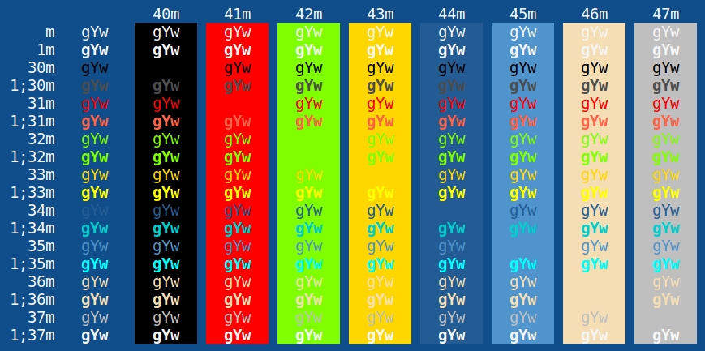

# Blue Mood for Xresources

This is a port of [emacs's Blue Mood theme](https://emacsthemes.com/themes/blue-mood-theme.html) for Xresources (xterm, (u)rxvt, and other X11 applications).

## Installation

### Manual
Copy the content of the `blue-mood.Xresources` file into the `~/.Xresources` or `~/.Xdefaults` file and reload the settings with `xrdb`.

### Via `#include`
Copy the `blue-mood.Xresources` file to any place and import it by writing in your regular `~/.Xresources` file `#include "/path/to/blue-mood.Xresources"`.

### Via `merge`
To merge the color theme into your current settings copy the `blue-mood.Xresources` file to any place and run `xrdb -merge /path/to/blue-mood.Xresources`.

## Usage note

In case you want to apply the theme to one application only, add its name before the `*` part of the defined values (e.g. `XTerm*background`, `URxvt*background`).
